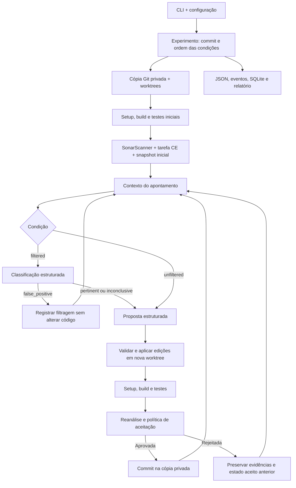

# Arquitetura

## Organização

A pipeline é um processo Python com CLI, configuração YAML validada por Pydantic e adaptadores para análise estática, LLM e execução de comandos. Não há serviço HTTP, fila ou banco remoto da aplicação. O PostgreSQL do Compose pertence exclusivamente ao SonarQube.



## Módulos e responsabilidades

| Módulo | Responsabilidade |
|---|---|
| `cli.py` | Comandos, diagnóstico e apresentação dos caminhos produzidos. |
| `config.py` | Contratos de configuração; caminhos relativos resolvidos a partir do YAML. |
| `models.py` | Contratos de apontamentos, snapshots, classificação, proposta, tentativa e execução. |
| `tracking.py` | Identidades independentes por ocorrência e acompanhamento pela chave do scanner. |
| `orchestration.py` | Baseline, condições, repetições, limites, aceitação e checkpoints. |
| `workspace.py` | Resolução do commit, clone privado e worktrees destacadas. |
| `runner.py` | Comandos locais ou Docker, limites de recursos, prazo e logs. |
| `sonar.py` | Scanner, acompanhamento da tarefa de análise, paginação e métricas. |
| `context.py` | Contexto limitado, trechos do arquivo, testes próximos e remoção de dados sensíveis reconhecidos. |
| `llm.py` | Chamadas estruturadas, validação JSON, retentativas, orçamento e registro de prompts/respostas. |
| `patching.py` | Escopo de arquivos, correspondência exata dos trechos e geração do diff. |
| `storage.py` | JSON atômico, eventos JSONL e catálogo SQLite. |
| `reporting.py` | Resumos, pares comparáveis, CSV, gráfico e HTML local. |
| `evaluation.py` | Exportação cega de rótulos e avaliação da classificação. |

## Execução e isolamento

`experiment` executa todas as repetições das duas condições. A ordem das condições é embaralhada com `experiment.seed`. Cada condição começa no mesmo SHA resolvido antes do experimento; a semente não torna a resposta de um provedor LLM determinística.

O repositório avaliado deve existir localmente. A pipeline cria um clone com `--no-hardlinks`, sem checkout inicial, dentro dos artefatos. Cada baseline e cada proposta recebe uma worktree destacada. Commits aceitos ficam nesse clone; propostas rejeitadas permanecem nas respectivas worktrees para inspeção. Alterações não commitadas no repositório de entrada não entram no corpus; `source_dirty` registra sua existência.

No modo Docker, cada validação cria um contêiner, preservado durante setup, build e testes daquela validação. Dependências podem ser obtidas pela rede de setup; antes do build, o runner troca para a rede de execução, `none` nos exemplos. CPU, memória e quantidade de processos são limitados. O diretório da worktree é montado com escrita e os metadados Git com leitura. O contêiner é removido ao terminar a validação. O scanner usa um contêiner separado com acesso à rede do SonarQube.

O modo `local` executa os comandos na máquina e é adequado à demonstração e a projetos confiáveis. Os comandos configurados são responsabilidade do pesquisador. A pipeline não é um ambiente de execução para repositórios arbitrários não confiáveis.

## Contratos do modelo

A classificação devolve `label`, `rationale` e `evidence`; os rótulos permitidos são `pertinent`, `false_positive` e `inconclusive`. Apenas `false_positive` evita a proposta na condição filtrada. A decisão permanece nos artefatos e não altera a resolução do apontamento no SonarQube.

A proposta devolve `edits`, `explanation`, `expected_effect` e `risks`. Cada edição contém `path`, `old_text` e `new_text`. O trecho antigo precisa ocorrer exatamente uma vez. A aplicação é validada integralmente antes de escrever arquivos. Só é possível alterar arquivos existentes, versionados, permitidos pelos globs e fora dos padrões protegidos. O contrato não admite criação ou remoção de arquivos.

Os padrões padrão protegem testes, configurações de dependências, arquivos do scanner, credenciais e metadados Git. Há rejeição de supressões reconhecidas, como `NOSONAR`. Esses controles não substituem a revisão semântica: testes e regras não capturam todo comportamento possível.

O adaptador `openai` usa o endpoint `responses` e `openai_compatible` usa `chat/completions`, ambos com schema JSON. A compatibilidade depende do endpoint e do modelo configurados. Os prompts efetivamente usados são constantes versionadas em `llm.py`; a pasta `prompts/` serve como referência textual. Alterar somente os Markdown dessa pasta não altera a execução.

## Aceitação

Uma tentativa só recebe `accepted` quando:

1. A proposta respeita os limites e as proteções de arquivos.
2. Setup, build e testes retornam sucesso dentro dos prazos.
3. A validação e o scanner não modificam os arquivos versionados além das edições propostas.
4. O apontamento alvo deixa de aparecer e sua multiplicidade por identidade diminui.
5. Quando `reject_new_issues: true`, nenhum novo apontamento de manutenibilidade aparece por identidade.

A identidade inicial incorpora regra, caminho, linha, mensagem, âncora e ocorrência; assim, alertas iguais em locais diferentes permanecem independentes e os baselines dos dois braços podem ser pareados. Nas reanálises, a chave estável do SonarQube mantém essa identidade mesmo quando a linha muda. Uma chave inédita é tratada conservadoramente como novo apontamento. Se o scanner trocar as chaves de alertas inalterados, uma proposta pode ser rejeitada ou a verificação final pode acusar divergência; inspecione esse caso antes da coleta. Snapshots sem `tracking_id`, importados fora desse fluxo, usam a identidade legada de regra/caminho/âncora. A política consulta o conjunto de manutenibilidade, não promete ausência de novos problemas de segurança ou confiabilidade. O Quality Gate do SonarQube não é, por si, um critério de aceitação deste código.

Ao final, quando há tempo restante, a pipeline reanalisa o último estado aceito para evitar que o painel do projeto fique com a última proposta rejeitada. Uma divergência entre esse snapshot e o estado aceito é registrada como falha.

## Persistência

```text
output_dir/
├── catalog.sqlite3
└── exp-<id>/
    ├── experiment.json
    ├── workspace/
    │   ├── repository/
    │   └── worktrees/
    ├── runs/
    │   ├── r01-filtered/
    │   │   ├── result.json
    │   │   ├── config.json
    │   │   ├── environment.json
    │   │   ├── events.jsonl
    │   │   ├── baseline/
    │   │   ├── attempts/0001/
    │   │   ├── llm/
    │   │   └── final/
    │   └── r01-unfiltered/
    ├── report.html
    ├── summary.csv
    ├── attempts.csv
    ├── comparison.json
    └── chart.png
```

O SQLite é um índice consultável; os JSON e demais arquivos são as evidências completas. O relatório pode ser regenerado a partir de `result.json`. Checkpoints registram progresso, mas não existe comando de retomada: uma nova execução produz outro experimento. Para arquivar mantendo as worktrees operacionais, preserve a estrutura completa; worktrees Git contêm referências de caminho e podem exigir reparo se o diretório for movido.
